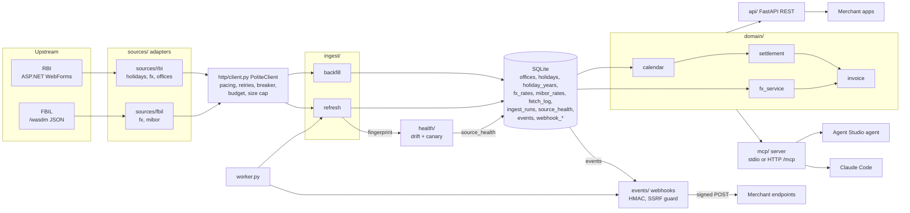
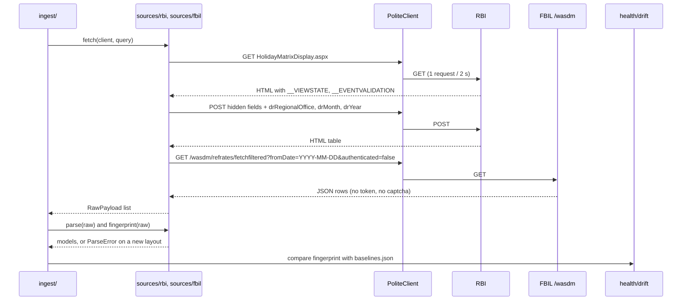
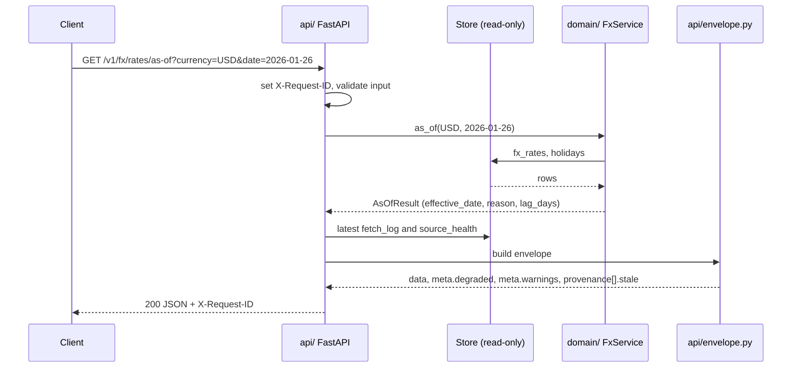
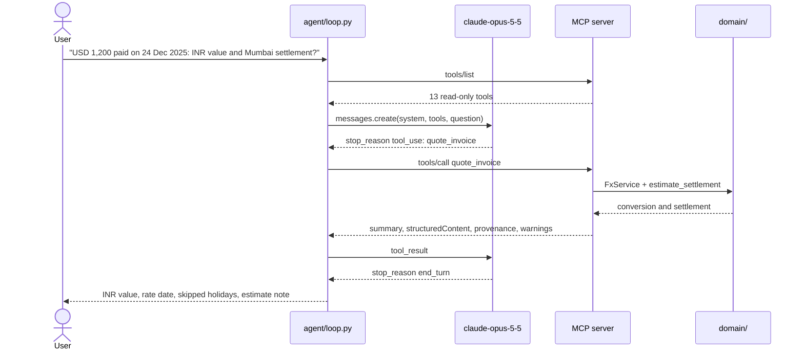
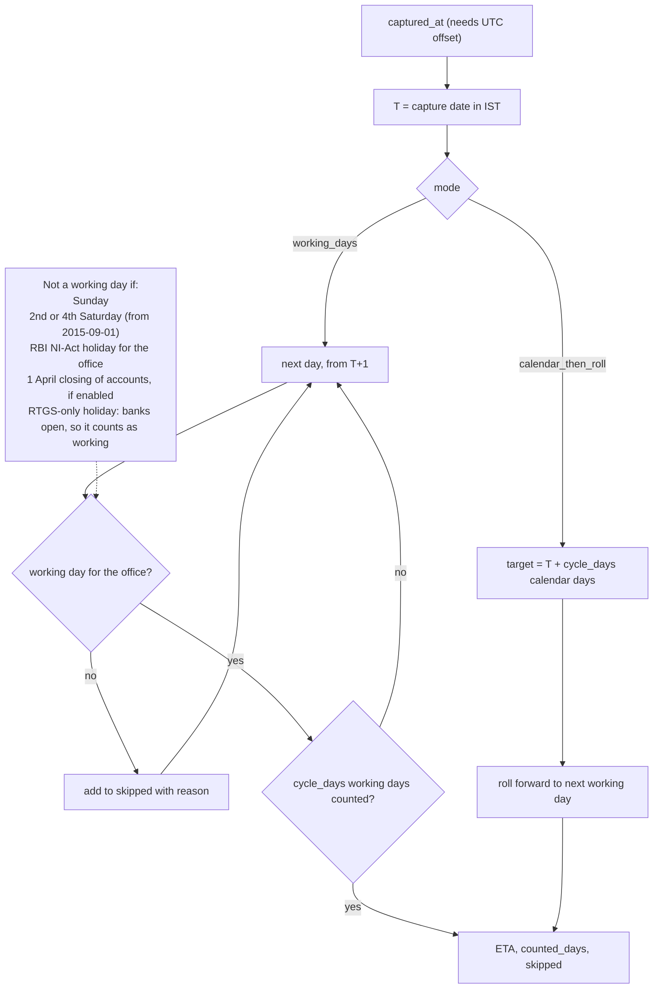
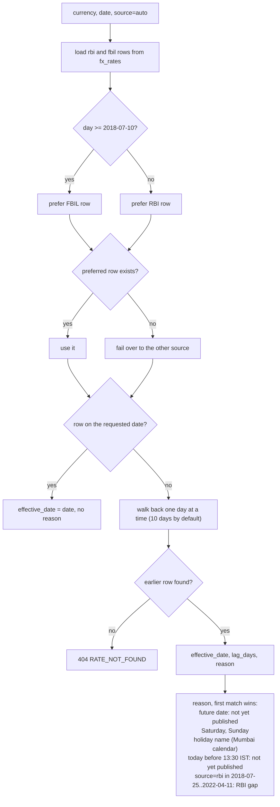
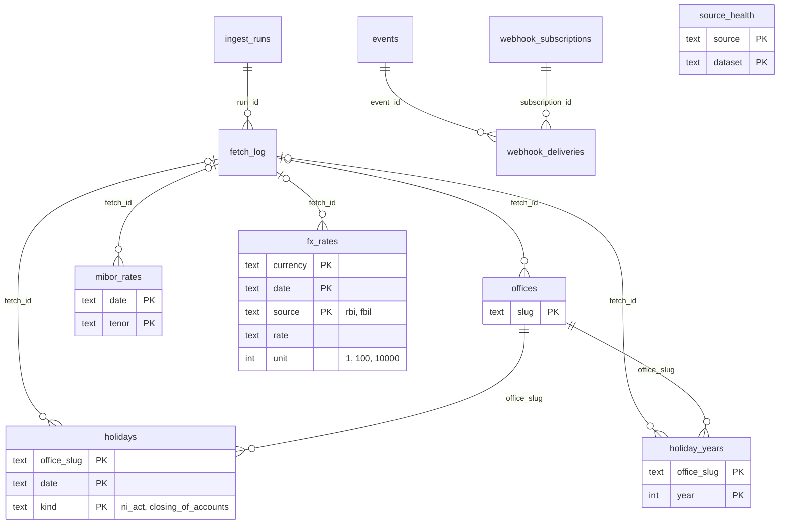
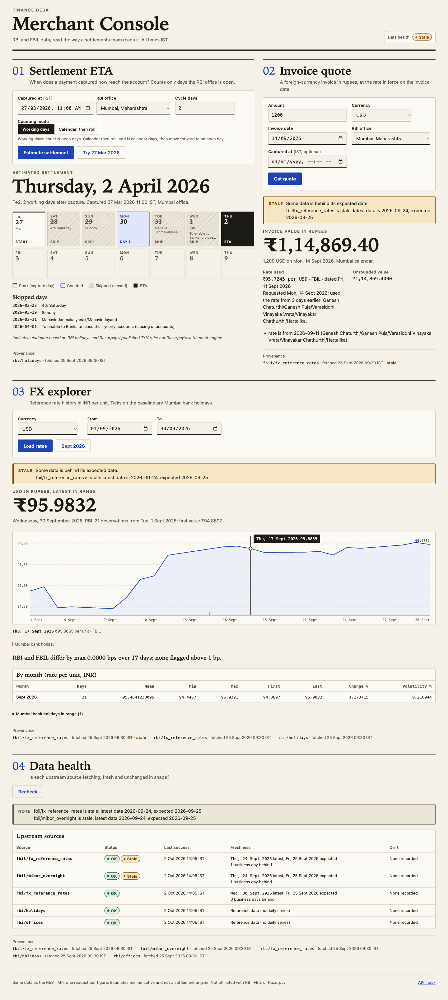

# India Merchant Data API

[](https://github.com/MohitGoyal09/india-merchant-data-api/actions/workflows/ci.yml)

An API for data that RBI and FBIL only publish as web pages.

Indian merchants ask two questions every day. "When does my settlement arrive?" The answer
depends on bank holidays. "What is this USD payment worth in INR on that date?" The answer
depends on the official reference rate. RBI and FBIL publish this data, but neither has an API.
RBI serves ASP.NET WebForms pages. FBIL serves an Angular app over an undocumented JSON backend.
This project reverse-engineers both and serves them as one typed REST API with provenance on
every response. It is a take-home for the Razorpay "reverse-engineer an API" task.

## What you get
| Dataset | Coverage | Source |
|---|---|---|
| FX reference rates (USD, GBP, EUR, JPY, AED, IDR) | 2000-01-03 to today (AED and IDR from 2026) | RBI before 2018-07-10, FBIL after. RBI fills 2022 on. |
| Bank holidays | 2001 to 2026, 34 RBI regional offices (13,282 holidays) | RBI |
| Overnight MIBOR | 2015-07-22 to today | FBIL |
| Business-day engine and settlement ETA | Per office. 2nd and 4th Saturdays, Sundays and holidays are not working days. | Computed from the holidays |
| Invoice quote | INR value of a foreign-currency invoice, plus settlement ETA | Computed |
| ICS feed | One calendar per office and year | Computed from the holidays |
| Webhooks | HMAC-signed events: rates published, holidays updated, new holiday year available, source degraded or recovered | Local |
| Health and drift | Status, drift report and freshness for each source | Local |

## How it works
**The rule: ingest fills a local SQLite file, and the API and MCP server only read it.** They never call RBI or FBIL while they answer. Every diagram follows real modules, tables and endpoints. More detail: [docs/ARCHITECTURE.md](docs/ARCHITECTURE.md).

**1. System architecture.** RBI and FBIL pages go through one polite HTTP client into SQLite. The API and the MCP server read SQLite through the same domain code. Two side paths run beside the main path: a drift check that writes `source_health`, and signed webhooks.

**2. Reverse-engineering flow.** RBI needs a GET for the hidden form fields, then a POST. FBIL needs one GET with ISO dates. Both end in the same parse and fingerprint check. Details: [docs/REVERSE_ENGINEERING.md](docs/REVERSE_ENGINEERING.md).

**3. Request lifecycle.** The route never calls upstream. The envelope adds where the data came from and flags stale or degraded sources. A domain error becomes `{"error": {code, message, details}, "request_id"}`.

**4. Agent over MCP.** The agent can only call read-only tools. A tool error returns as `isError=true` with a hint. The loop stops after 10 turns at most.

**5. Settlement ETA logic.** Every non-working day between T and the ETA is listed in `skipped` with its reason. If a touched year has no holiday data, the call fails with `CALENDAR_DATA_MISSING`.

**6. FX source merge and as-of.** Each row keeps its own `source`. Over 176 overlapping days in 2026, RBI and FBIL agree exactly (`GET /v1/fx/compare`).

**7. Data model.** Every data table has a `fetch_id` that points to the fetch that produced the row, so each answer has provenance. Links are labelled with the key column. `source_health` is keyed by (source, dataset). Rates are `Decimal` stored as text.


## Key numbers
| Item | Value |
|---|---|
| Rows in the database | 30,912 FX (2000-01-03 to 2026-10-01), 2,703 MIBOR (from 2015-07-22), 13,282 holidays (34 offices, 2001 to 2026) |
| Upstream requests | about 380 for the full history (41 MB), 47 for a backfill from 2024-01-01, 6 to 8 for a daily refresh |
| REST cases (`make cases`) | 31 cases: 30 passed, 0 failed, 1 skipped |
| Tests (`make check`, 2026-10-02) | 1,491 passed, 98.45% coverage (gate 80%); `mypy --strict` clean on 85 source files |
| Property tests (`tests/property`) | 60 passed |
| MCP contract tests (`tests/mcp`) | 238 passed |
| Keyless MCP demo (`make demo-mcp`) | 21/21 checks passed |
| Agent eval (live, `claude-opus-5-5`, run 4) | 16/16 passed in 9 categories (incl. safety), tool selection 100%, about USD 0.28. History: [evals/README.md](evals/README.md#live-run-history) |
| Security scans (`make security`) | `bandit` clean (medium and above), `pip-audit`: no known vulnerabilities, secret scan: no secrets found |

## Docs map
| Document | What it answers |
|---|---|
| [REVERSE_ENGINEERING](docs/REVERSE_ENGINEERING.md) | How were the RBI and FBIL backends found, and what is the evidence? |
| [LIMITATIONS](docs/LIMITATIONS.md) | What can break, what is an estimate, and what do the source terms allow? |
| [ARCHITECTURE](docs/ARCHITECTURE.md) | How do the parts fit, and why were they built this way? |
| [API](docs/API.md) | What are the envelope, error codes, pagination, CSV, ICS and webhook formats? |
| [MCP](docs/MCP.md) | What tools does the agent connector have, and how do I connect a host? |
| [FDE_PLAYBOOK](docs/FDE_PLAYBOOK.md) | How does a forward-deployed engineer take this to a merchant? |
| [RUNBOOK](docs/RUNBOOK.md) | How do I run it every day, rotate tokens, back up, watch it and fix it? |
| [SECURITY](docs/SECURITY.md) | What are the threats, the controls and the test evidence? |
| [PLAN](docs/PLAN.md) | What was planned for the REST API, and why? |
| [PLAN_MCP](docs/PLAN_MCP.md) | What was planned for the MCP connector and its evals? |
| [evals/README](evals/README.md) | How are the agent evals built, scored and run, and what are the results? |

## Quickstart
You need [uv](https://docs.astral.sh/uv/) and Python 3.12 or newer.

```bash
make install                 # install dependencies
cp .env.example .env         # settings; edit IMDA_USER_AGENT to add your contact
make cases                   # offline, no network: runs 31 named API cases
```

`make cases` seeds a temporary database from recorded fixtures and runs every case in-process. It never touches RBI or FBIL.

To load real data, run the backfill. It is live, polite (1 request every 2 seconds per host) and safe to run again.

```bash
uv run imda backfill --from 2024-01-01   # measured: 47 requests, about 92 seconds
make serve                               # http://127.0.0.1:8000, docs at /docs
```

The full history (2000 to today) needs about 380 requests. A daily `uv run imda refresh` needs 6 to 8.

### Five requests
Real responses from a database backfilled on 2026-10-02, trimmed. `fetched_at` will differ on your machine.

**1. The USD rate on Republic Day (a bank holiday)**
```bash
curl -s "http://127.0.0.1:8000/v1/fx/rates/as-of?currency=USD&date=2026-01-26"
# response (trimmed):
{"data": {"currency": "USD", "requested_date": "2026-01-26", "effective_date": "2026-01-23",
          "lag_days": 3, "reason": "Republic Day",
          "rate": {"date": "2026-01-23", "rate": "91.6195", "unit": 1, "source": "fbil"}},
 "meta": {"degraded": false,
          "warnings": ["fbil/fx_reference_rates is stale: latest data is 2026-09-24, expected 2026-10-01"]}}
```

The warning is real: FBIL was 5 business days behind that day, and the response says so.

**2. Settlement ETA for a payment captured on Friday 2026-03-27 in Mumbai**
```bash
curl -s "http://127.0.0.1:8000/v1/settlement/eta?captured_at=2026-03-27T11:00:00%2B05:30&office=mumbai"
# response (trimmed):
{"data": {"eta_date": "2026-04-02", "cycle_days": 2, "mode": "working_days",
          "counted_days": ["2026-03-30", "2026-04-02"],
          "skipped": [{"date": "2026-03-28", "reason": "4th Saturday"},
                      {"date": "2026-03-29", "reason": "Sunday"},
                      {"date": "2026-03-31", "reason": "Mahavir Janmakalyanak/Mahavir Jayanti"},
                      {"date": "2026-04-01", "reason": "... (closing of accounts)"}]}}
```

**3. Convert 1000 JPY to INR (RBI quotes JPY per 100)**
```bash
curl -s "http://127.0.0.1:8000/v1/fx/convert?amount=1000&from=JPY&to=INR&date=2026-09-30"
# response (trimmed):
{"data": {"result": "611.60", "exact": "611.6000",
          "rates_used": [{"rate": {"rate": "61.1600", "unit": 100, "rate_per_unit": "0.6116", "source": "rbi"}}]}}
```

**4. Invoice quote: USD 1250.50 invoiced on 2026-09-30, captured the same day**
```bash
curl -s -X POST http://127.0.0.1:8000/v1/invoice/quote -H "Content-Type: application/json" \
  -d '{"amount":"1250.50","currency":"USD","invoice_date":"2026-09-30","office":"mumbai","captured_at":"2026-09-30T11:00:00+05:30"}'
# response (trimmed):
{"data": {"conversion": {"result": "120026.99", "exact": "120026.991600",
                         "rates_used": [{"rate": {"rate": "95.9832", "source": "rbi"}}]},
          "settlement": {"eta_date": "2026-10-03", "counted_days": ["2026-10-01", "2026-10-03"],
                         "skipped": [{"date": "2026-10-02", "reason": "Mahatma Gandhi Jayanti"}]}}}
```

**5. Source health**
```bash
curl -s http://127.0.0.1:8000/v1/sources/health | jq '.data.status, (.data.sources[] | {source, dataset, status, drift: .drift.summary, stale: .freshness.stale})'
# response (trimmed):
"ok"
{"source": "fbil", "dataset": "fx_reference_rates", "status": "ok", "drift": "no drift", "stale": true}
{"source": "fbil", "dataset": "mibor_overnight",    "status": "ok", "drift": "no drift", "stale": true}
{"source": "rbi",  "dataset": "fx_reference_rates", "status": "ok", "drift": "no drift", "stale": false}
{"source": "rbi",  "dataset": "holidays",           "status": "ok", "drift": "no drift", "stale": null}
{"source": "rbi",  "dataset": "offices",            "status": "ok", "drift": null,       "stale": null}
```

Envelope, errors, pagination, CSV and ICS are described in [docs/API.md](docs/API.md).

## Docker quickstart
```bash
make docker-build                                    # builds image imda:dev
docker compose up -d api worker                      # api on 127.0.0.1:8000, worker refreshes data
docker compose --profile tools run --rm backfill     # one-shot live backfill from 2024-01-01
```

`api` and `worker` share one volume (`imda-data`). The worker runs `imda refresh` every 360 minutes and delivers webhooks every 30 seconds. The image runs as a non-root user. Compose reads `.env`. Stop with `docker compose down` (`-v` also deletes the data volume). This exact flow was tested: the backfill took 47 requests and about 92 seconds, and `/healthz` returned `ok`.

## The test-case script
`scripts/run_cases.py` runs 31 named cases through the real API and prints a table.

| Command | What it does |
|---|---|
| `make cases` | Offline. Seeds a temp database from recorded fixtures and runs the cases in-process. No network. Exact values are checked. |
| `make cases-live` | Runs the cases against a running `make serve` on your real database. Default `BASE_URL=http://127.0.0.1:8000`. Override with `make cases-live BASE_URL=http://host:port`. |

Extra options: `--filter TEXT` runs only matching cases. `--json FILE` writes a JSON report.

Exit code: `0` when no case failed, `1` when at least one failed. A `SKIP` is not a failure. Offline mode skips case 11 (it needs real 2026-01 data). Live mode skips case 27 (it needs a year that is not loaded).

Real output of `make cases` (excerpt: the ENDPOINT and `ms` columns and 19 rows are left out for width; the summary line is real):

```text
 #  CASE                                         EXPECT                                            RESULT
 1  offices: 34, Mumbai is Maharashtra           200, 34 offices                                   PASS
 7  settlement: T+2 from 27 Mar skips 4 days     200, ETA 2026-04-02, 4 skipped                    PASS
10  fx as-of: holiday falls back to prior day    200, 2026-09-14 -> 2026-09-11 (Ganesh Chaturthi)  PASS
11  fx as-of: Republic Day -> 23 Jan             200, 2026-01-26 -> 2026-01-23 (Republic Day)      SKIP
14  fx rates: cursor pages do not overlap        200, limit=5 -> next_cursor, full walk            PASS
16  convert: 1000 JPY uses unit 100              200, 606.20 INR, unit 100                         PASS
18  convert: USD to EUR is a cross rate          200, is_cross_rate, 2 rates used                  PASS
20  compare: RBI vs FBIL agree in Sept 2026      200, max_abs_diff_bps 0                           PASS
21  invoice: quote USD 1200 with settlement      200, INR amount + ETA 2026-09-28 + notes          PASS
24  error: invalid date format                   422 INVALID_REQUEST                               PASS
27  error: holiday year not loaded               409 CALENDAR_DATA_MISSING                         PASS
29  error: amount with 3 decimals                422 VALIDATION_ERROR                              PASS

31 cases: 30 passed, 0 failed, 1 skipped
```

`make cases-live` was also run against a server on the backfilled database: 30 passed, 0 failed, 1 skipped.

## Merchant Console
A static web page over the same REST API. It shows the rate in force on a date, a settlement ETA, an invoice quote, and source health. It needs no build step and no extra service.

```bash
make serve    # then open http://127.0.0.1:8000/console
```

The page sets a strict Content-Security-Policy: scripts, styles, images and fetches come only from the same origin, and framing is blocked. [Light, 1440 px](docs/screenshots/console-1440-light.png):



Other captures: [dark, 1440 px](docs/screenshots/console-1440-dark.png), [light, 375 px](docs/screenshots/console-375-light.png), [dark, 375 px](docs/screenshots/console-375-dark.png).

## Endpoints
Read endpoints are open (meant for localhost). Admin endpoints need
`Authorization: Bearer $IMDA_ADMIN_TOKEN`. Full spec: [docs/openapi.json](docs/openapi.json).

| Method | Path | Purpose |
|---|---|---|
| GET | `/healthz` | Liveness. No database access. |
| GET | `/readyz` | Readiness. `200` only when the database is migrated, FX and holidays are loaded and no source is `broken`. Otherwise `503` with a reason for each check. |
| GET | `/console` | The Merchant Console: a static page over this API (see below). |
| GET | `/v1/offices` | The 34 RBI regional offices. |
| GET | `/v1/holidays?year=&office=&month=` | Bank holidays. |
| GET | `/v1/calendar/business-day?date=&office=` | Is the date a working day? If not, why. |
| GET | `/v1/calendar/next-business-days?date=&office=&n=` | The next N working days. |
| GET | `/v1/calendar/{office}.ics?year=` | Subscribable ICS feed. |
| GET | `/v1/settlement/eta?captured_at=&office=&cycle_days=&mode=` | Indicative settlement date and each skipped day. |
| GET | `/v1/fx/rates?currency=&from=&to=&source=&limit=&cursor=&format=` | Rate history (JSON with cursor, or CSV). |
| GET | `/v1/fx/rates/as-of?currency=&date=` | The rate in force on a date, with the reason if it is an earlier day. |
| GET | `/v1/fx/convert?amount=&from=&to=&date=` | Convert to or from INR. Cross rates go through INR. |
| GET | `/v1/fx/stats?currency=&from=&to=&period=` | Weekly or monthly mean, min, max, change, volatility. |
| GET | `/v1/fx/compare?currency=&from=&to=` | RBI against FBIL on overlapping dates. |
| POST | `/v1/invoice/quote` | INR value of an invoice plus settlement ETA. |
| GET | `/v1/rates/mibor?from=&to=` | Overnight MIBOR. |
| GET | `/v1/sources/health` | Status, drift and freshness for each source. |
| POST, GET, DELETE | `/v1/webhooks`, `/v1/webhooks/{id}`, GET `/v1/webhooks/{id}/deliveries` | Create (secret shown once), list, stop, and read the delivery log. (admin) |
| POST | `/v1/admin/refresh`, `/v1/admin/webhooks/dispatch` | Start a background refresh (cooldown 300 s). Start one background webhook delivery pass. Both return `202`. (admin) |

CLI: `imda backfill`, `refresh`, `status`, `serve`, `canary`, `worker`, `webhooks dispatch`.

## Configuration
Set these as environment variables or in `.env`. All start with `IMDA_`.

| Variable | Default | Meaning |
|---|---|---|
| `IMDA_USER_AGENT` | `india-merchant-data-api/0.1 (+repo URL; research demo)` | Sent to RBI and FBIL. Add your contact. |
| `IMDA_DB_PATH` | `data/imda.sqlite3` | SQLite file. |
| `IMDA_UPSTREAM_ENABLED` | `true` | Kill switch. `false` sends no upstream request. |
| `IMDA_MIN_INTERVAL_SECONDS` | `2.0` | Minimum gap between requests to one host. |
| `IMDA_REQUEST_BUDGET` | `500` | Hard cap on upstream requests for one run. |
| `IMDA_ADMIN_TOKEN` | not set | Bearer token for admin endpoints. With no token they return 503. |
| `IMDA_SETTLEMENT_CYCLE_DAYS` | `2` | Default settlement cycle (T+N). |
| `IMDA_CLOSING_OF_ACCOUNTS_IS_HOLIDAY` | `true` | Treat 1 April (banks' closing of accounts) as a non-working day. |

## Assumptions
- Settlement is T+N **working** days. The default N is 2, from Razorpay's public docs.
- A working day is not a Sunday, not a 2nd or 4th Saturday (rule from 2015-09-01), and not an RBI holiday for the office.
- Banks' closing of accounts (1 April) is a non-working day by default (configurable). RTGS-only holidays are not bank holidays: banks are open.
- Holidays are per RBI regional office (34 cities), not per bank branch. The caller maps a bank to the nearest office.
- FX "publication day" follows the Mumbai calendar. FBIL publishes after about 13:30 IST.
- `source=auto` uses FBIL from 2018-07-10 and RBI before. Over 176 overlapping days in 2026, the two agree exactly.
- Dates and times are Indian Standard Time (IST). `captured_at` must carry a UTC offset.
- Currencies are USD, GBP, EUR, JPY, AED and IDR. JPY is quoted per 100, and IDR per 10,000. The unit is stored with every rate.
- You run this locally. It is not a hosted service and not a data mirror.

## Limitations
The short version. The full text is in [docs/LIMITATIONS.md](docs/LIMITATIONS.md).

- **Fragility.** Scraped pages can change without notice. The service detects shape changes (drift canary), stops ingest for that dataset, and keeps serving the last good data with `meta.degraded: true`.
- **Terms and licence.** RBI says it may block IPs and bars caching. FBIL says redistribution needs its authorisation. So the repo ships the backfill script, not the data. Production use needs an FBIL data licence.
- **Settlement is an estimate.** It is not Razorpay's settlement engine. Razorpay's docs text and worked example disagree, so two modes exist: `working_days` and `calendar_then_roll`.
- **Single node.** SQLite and sync code. Fine for about 50,000 rows, not for multi-tenant scale.
- **Long-term fix.** Official feeds: an RBI holiday calendar in ICS or JSON, and a licensed FBIL data feed. Each source sits behind one adapter, so switching to a feed replaces one file. The API does not change.

## How it was reverse-engineered
The method and the evidence are in [docs/REVERSE_ENGINEERING.md](docs/REVERSE_ENGINEERING.md).

- **RBI** serves ASP.NET WebForms. Each query is a GET for the hidden form fields (`__VIEWSTATE`, `__EVENTVALIDATION`), then a POST with the dropdown values. Four holiday page layouts are parsed.
- **FBIL** serves an Angular app. Reading its JavaScript bundle gave the JSON endpoints. They need no token and no captcha, but they need ISO dates. Other formats return HTTP 500.
- Pages that need a browser-only bot challenge, a captcha or a login (NPCI, RBI PSI files, GST portal) were rejected. This project never gets around them.
- The 2000 to 2026 backfill found three layout changes (2005, 2007, 2018). Each stopped ingest with a clear error, and each became a fixture and a test.

## Project layout
```text
src/imda/   sources/ (rbi, fbil adapters)  http/ (PoliteClient)  ingest/  store/  domain/
            health/ (drift, canary)  events/ (webhooks)  api/ (FastAPI)  cli.py
scripts/    run_cases.py, cases.py, fixture recorders
tests/      unit/  api/  property/  mcp/  contract/  fixtures/
docs/       see the Docs map above
```

Design and data flow: [docs/ARCHITECTURE.md](docs/ARCHITECTURE.md).

## Testing
| Layer | Command | What it proves |
|---|---|---|
| Unit and API | `make check` | `ruff`, `mypy --strict` and the offline tests with coverage (gate 80%). 2026-10-02: 1,491 passed, 98.45%. |
| Property | `uv run pytest tests/property` | 60 `hypothesis` tests. Set `HYPOTHESIS_PROFILE=ci` for the CI profile. |
| Contract (live) | `make test-live` | 5 opt-in tests that call real RBI and FBIL (about 40 seconds). |
| Assignment cases | `make cases`, `make cases-live` | 31 named cases: offline on fixtures, or against a running `make serve`. |
| MCP contract | `make mcp-evals` | 238 tests of the 13 tools, with no LLM and no network. |
| Keyless MCP demo | `make demo-mcp` | Starts `imda mcp` over stdio and runs 21 asserted checks. |
| Docker smoke | `make smoke-compose` | Builds the image and probes `api` and `mcp` in an isolated compose project. Needs Docker. |
| Security | `make security` | `bandit`, `pip-audit` and a scan of tracked files for secrets. |
| Agent evals | `make agent-evals` | 16 merchant questions answered by Claude through MCP. Needs `ANTHROPIC_API_KEY`. Add `ARGS=--dry-run` to check the case file with no key. |

Other command: `make canary` samples each source once and checks it against the baselines.

## Security notes
- No credentials are in the repo. `.env` and `data/` are git-ignored. `.env.example` has no secrets.
- The admin token comes only from `IMDA_ADMIN_TOKEN`. It is compared in constant time and is never logged. With no token, write endpoints are off.
- The client sends an honest User-Agent and never gets around bot protection, captchas or logins. Upstream load is bounded: 1 request every 2 seconds per host, a request budget, a circuit breaker and a kill switch.
- Webhook targets must be `https` and must not resolve to private, loopback or link-local addresses. Deliveries are HMAC-signed with a timestamp. The API binds to `127.0.0.1` by default.

## MCP connector (Agent Studio)
`imda mcp` runs a read-only [MCP](https://modelcontextprotocol.io) server with 13 tools over the same data as the REST API. An AI agent, such as a Razorpay Agent Studio agent, can use them to answer "Is 2 October a bank holiday in Chennai?" or "What is USD 1,250.50 in INR, and when does it settle in Mumbai?".

```bash
uv run imda mcp                                                        # stdio (Claude Code, Desktop)
IMDA_MCP_TOKEN=<32+ chars> uv run imda mcp --transport http --port 8100   # streamable HTTP at /mcp, bearer token
make mcp-evals                                                         # 238 offline contract tests
```

Every result has a summary line, JSON, `provenance` and `warnings`. Errors are results with `isError=true` and a `{code, message, hint}` body. The agent cannot write data, cannot call RBI or FBIL, and gives settlement dates as estimates.

- [docs/MCP.md](docs/MCP.md): tools, host configs, errors, and what the agent can and cannot do.
- [docs/mcp_tool_spec.json](docs/mcp_tool_spec.json): the tool spec, generated from the live server.
- [docs/PLAN_MCP.md](docs/PLAN_MCP.md): design decisions and the eval plan.

## Licence

All rights reserved. Shared for evaluation only. See [NOTICE](NOTICE).
