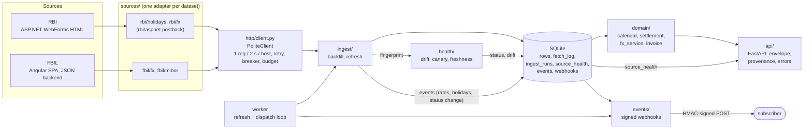

# Architecture

This service turns two websites with no API (RBI and FBIL) into one typed REST API. The design
rule is simple: **ingest fills a local SQLite file, and the API only reads that file.** The API
never calls RBI or FBIL while it answers a request.

The build plan and its reasons are in [PLAN.md](PLAN.md). How each site was mapped is in
[REVERSE_ENGINEERING.md](REVERSE_ENGINEERING.md). Known limits are in
[LIMITATIONS.md](LIMITATIONS.md).

## Components and data flow



| Folder | Job |
|---|---|
| `src/imda/sources/` | One adapter per dataset. It fetches, parses and fingerprints. It never touches storage. |
| `src/imda/http/client.py` | `PoliteClient`: the only code that makes upstream requests. |
| `src/imda/ingest/` | `backfill` (history) and `refresh` (what is new). Writes rows, logs and health. |
| `src/imda/store/` | SQLite access (WAL mode, foreign keys on). No ORM. |
| `src/imda/domain/` | Pure logic: business days, settlement ETA, FX as-of, convert, stats, compare, invoice. |
| `src/imda/health/` | Drift check against `baselines.json`, canary, freshness. |
| `src/imda/events/` | Webhook signing, SSRF guard, delivery with retries. |
| `src/imda/api/` | FastAPI app, routes, success envelope, error handlers, ICS and CSV output. |
| `src/imda/worker.py`, `cli.py` | The `imda` command and the scheduled worker. |

## The SourceAdapter contract

Defined in `src/imda/sources/base.py`. Each adapter has a `source`, a `dataset` and three methods.

```python
class SourceAdapter(Protocol[Q, T]):
    source: Source
    dataset: Dataset
    def fetch(self, client: HttpClient, query: Q) -> Sequence[RawPayload]: ...
    def parse(self, raw: RawPayload) -> Sequence[T]: ...          # raises ParseError
    def fingerprint(self, raw: RawPayload) -> dict[str, object]: ...
```

- `fetch` may make more than one request (RBI needs a GET, then a POST with hidden form fields).
- `parse` returns typed models. A page with an unexpected shape raises `ParseError`. It never
  returns partial or guessed data.
- `fingerprint` is a summary of the page shape, with no data values. Ingest compares it with
  `health/baselines.json`.
- `HttpClient` is a one-method protocol (`send`). Tests pass a fake. Production passes
  `PoliteClient`.

## Key decisions

| # | Decision | Reason |
|---|---|---|
| D1 | The API reads local SQLite, never the upstream site. | Fast answers, bounded upstream load, and the API can serve the last good data when a source fails. |
| D2 | Sync code: `httpx` sync, stdlib `sqlite3`. | Ingest makes one request at a time anyway, because of the politeness limit. Simple code. |
| D3 | The `SourceAdapter` protocol. | A new source is about one file. MIBOR was added this way. |
| D4 | `source=auto` uses FBIL from 2018-07-10 and RBI before. The other source fills gaps. Every row keeps its `source`. | FBIL has run the benchmark since July 2018. RBI has a gap from 2018-07-25 to 2022-04-11. |
| D5 | Money uses `Decimal` only. Rates keep their unit (1, 100 or 10000). | No float drift. JPY is quoted per 100, so the unit must travel with the rate. |
| D6 | A business day is not a Sunday, not a 2nd or 4th Saturday, and not an RBI holiday for that office. | Matches the Razorpay settlement docs and RBI practice. |
| D7 | Write endpoints need `IMDA_ADMIN_TOKEN`. With no token they return 503. | Smallest auth that is safe by default. |
| D8 | The repo ships the backfill script, not the data. `data/` is git-ignored. Test fixtures are small recorded samples. | Respects RBI's "no caching" clause and FBIL's redistribution terms. |

## Request lifecycle

1. The middleware sets a request id (a valid incoming `X-Request-ID`, or a new one) and starts a
   timer.
2. The route validates input with strict types: ISO dates, aware datetimes, decimal strings,
   currency enum, office slug.
3. The route reads from SQLite through `domain/`. The holiday calendar is cached for 60 seconds.
4. `api/envelope.py` builds the response. For each (source, dataset) the answer used, it adds a
   `provenance` entry from the latest `fetch_log` row. It marks the entry `stale` when the newest
   data date is older than the last Mumbai business day. It sets `meta.degraded` when the source
   health is `degraded` or `broken`, and adds a warning.
5. Errors go through one handler. The body is `{"error": {code, message, details}, "request_id"}`.
   An unexpected exception becomes `INTERNAL_ERROR`, and the trace stays in the server log.
6. The middleware writes one JSON access-log line and returns the `X-Request-ID` header.

Field names and the error code list are in [API.md](API.md).

## Ingest lifecycle

1. `imda backfill` or `imda refresh` (or the worker) opens one `ingest_runs` row.
2. Each (source, dataset) is a **task**. Tasks run one after another. A failing task does not stop
   the others.
3. Every upstream attempt, including retries, is written to `fetch_log`: URL, parameters, status,
   bytes, SHA-256 and duration. Each stored row links to the fetch that produced it.
4. A task parses its payloads, then compares the fingerprint with the baseline.
5. The task sets `source_health`:

   | Outcome | Health |
   |---|---|
   | Parsed, shape matches | `ok` |
   | Parsed, shape drifted | `degraded` (the rows are kept) |
   | Upstream error (network, 5xx, 429, open breaker, budget spent) | `degraded` |
   | `ParseError`, bad value, constraint error | `broken` (nothing stored from that payload) |

6. On a change of health, ingest writes one event: `source.degraded` or `source.recovered`. New FX
   rates and holiday rows write `fx.rates.published` and `holidays.updated`.
7. The run ends as `ok`, `partial` (some tasks failed) or `failed` (all tasks failed).
8. The dispatcher (`imda worker`, or `imda webhooks dispatch`) turns events into signed POSTs. It
   checks the URL against the SSRF guard again before each delivery and logs every attempt.

`imda canary` runs the same steps on a small sample (at most 6 requests). It writes health and
events only. It never writes rates or holidays.

## Failure modes

| Failure | What happens | What the client sees |
|---|---|---|
| Upstream down, 5xx, 429, timeout | `PoliteClient` retries with backoff (4 attempts). Then the task fails and health becomes `degraded`. Other tasks still run. After 5 failures on a host, the breaker stays open for 10 minutes. | The last good data. `meta.degraded: true` and a warning. Never a 500. |
| Upstream disabled (`IMDA_UPSTREAM_ENABLED=false`) or budget spent | Same as "upstream down". No request is sent. | Same as above. |
| Parse error (page changed or cut off) | `ParseError`. Nothing is stored from that payload. Health becomes `broken`. `source.degraded` fires once. | The last good data and `meta.degraded: true`. |
| Drift (shape changed, still parses) | Rows are kept. Health becomes `degraded`. The drift report is stored. | `GET /v1/sources/health` shows added, removed and changed keys. |
| Stale source (for example FBIL lagging) | Computed on each request, not stored. | `provenance[].stale: true` and a warning. `source=auto` still uses the other source for dates it lacks. |
| Holiday year not loaded | `CalendarDataMissing`. | `409 CALENDAR_DATA_MISSING` with a `hint` command. For FX, a warning says staleness was not checked. |
| No rate in the 10-day as-of window | `RateNotFound`. | `404 RATE_NOT_FOUND`. |

## How to add a new source

1. Map the site by hand first (see REVERSE_ENGINEERING.md). If a plain client is blocked by bot
   protection or a captcha, stop. The source is out of scope.
2. Record one real response per layout under `tests/fixtures/<source>/`, with a `*.meta.json`
   that holds the request. `scripts/record_rbi_fixtures.py` and `scripts/record_fbil_fixtures.py`
   show how.
3. Add `src/imda/sources/<source>/<dataset>.py` with `fetch`, `parse` and `fingerprint`. Parse into
   a model from `models.py`. Raise `ParseError` on any unexpected shape.
4. Add the dataset to `Dataset` / `Source` in `models.py`. Add a table or column in
   `store/schema.sql` and the read and write methods in `store/repo.py`.
5. Add a loader in `ingest/loaders.py` and a task in `ingest/backfill.py` and
   `ingest/refresh.py`.
6. Run `python scripts/update_baselines.py` to record the fingerprint in
   `health/baselines.json`.
7. Add a route under `src/imda/api/routes/` and register it in `api/app.py`. Return the
   `success(...)` envelope with a `Used(source, dataset)` entry so provenance works.
8. Add unit tests (parser on fixtures), a fault-injection test, an API test, and a case in
   `scripts/cases.py`. Then run `make check` and `make cases`.

## Testing strategy

| Layer | Where | What it proves |
|---|---|---|
| Unit | `tests/unit/` | Parsers on recorded fixtures, the calendar and settlement rules, `Decimal` FX math, signing, SSRF guard, retry, backoff, breaker, store, CLI. |
| Contract | `tests/unit/test_contracts.py`, `test_drift.py` | Each adapter's output fits its model. Each fingerprint fits `baselines.json`. |
| Fault injection | `test_http_client.py`, `test_ingest.py`, `test_canary.py` | 429 with `Retry-After`, timeouts, 5xx, truncated pages and unknown markers lead to `degraded` or `broken` health, kept data and no 500. |
| API | `tests/api/` | Every endpoint, on the success path and on each error code. |
| Live (opt-in) | `tests/contract/`, `make test-live` | A few real calls to RBI and FBIL. They are not part of `make test`. |
| Cases script | `scripts/run_cases.py`, `scripts/cases.py` | 31 named cases through the real API. `make cases` runs offline on a seeded fixture database. `make cases-live` runs against a running server. |

`make check` runs `ruff`, `mypy --strict` and the offline tests with coverage. Result on
2026-10-02: lint clean, mypy clean on 60 source files, **817 tests passed** (5 live tests
deselected), **98.72% coverage** (the gate is 80%). CI runs the same `make check`
(`.github/workflows/ci.yml`).
